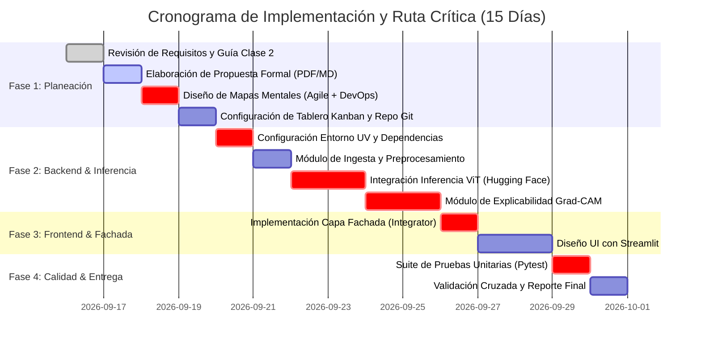

# UNIVERSIDAD AUTÓNOMA DE OCCIDENTE
## Especialización en Inteligencia Artificial
### Desarrollo de Soluciones de Inteligencia Artificial II — Módulo 2

---

# PROPUESTA FORMAL DE PROYECTO: SISTEMA INTELIGENTE DE CLASIFICACIÓN DE LESIONES DERMATOLÓGICAS MEDIANTE VISION TRANSFORMERS Y EXPLICABILIDAD VISUAL (XAI)

**Equipo de Trabajo (Grupo Único):**
* **Marlon Valencia Velosa** — Código Estudiantil: `1113531444`
* **Miguel Ángel Ortiz Roldán** — Código Estudiantil: `6200485`


**Fecha de Entrega:** 22 de Septiembre de 2026 (Clase 4 - Virtual)  
**Repositorio GitHub:** `https://github.com/marlonvalenciamentor-eng/skin-lesion-classifier`

---

## ÍNDICE GENERAL
1. [Capítulo 1: Contexto del Proyecto](#capítulo-1-contexto-del-proyecto)
2. [Capítulo 2: Objetivos y Alcance](#capítulo-2-objetivos-y-alcance)
3. [Capítulo 3: Cronograma y Ruta Crítica (CPM)](#capítulo-3-cronograma-y-ruta-crítica-cpm)
4. [Capítulo 4: Marco de Investigación y Metodología CRISP-DM](#capítulo-4-marco-de-investigación-y-metodología-crisp-dm)
5. [Capítulo 5: Gestión de Tareas (Kanban)](#capítulo-5-gestión-de-tareas-kanban)
6. [Capítulo 6: Anexos y Repositorios](#capítulo-6-anexos-y-repositorios)

---

## CAPÍTULO 1: CONTEXTO DEL PROYECTO

### 1.1. Descripción del Problema y Justificación
El cáncer de piel se sitúa entre las neoplasias malignas de mayor incidencia a nivel global. El melanoma, en particular, representa la forma más letal debido a su elevado potencial metastásico si no se detecta en fases tempranas. La inspección visual dermatoscópica convencional demanda una curva de aprendizaje prolongada y está sujeta a variabilidad inter-observador (sensibilidad del 65% al 85% en profesionales no especializados).

La adopción de la Inteligencia Artificial en salud mediante **Sistemas de Soporte a la Decisión Clínica (CDSS)** no pretende sustituir el criterio médico, sino actuar como un filtro preliminar (triaje) de alta sensibilidad que optimice los tiempos de atención, priorice casos críticos y reduzca la tasa de falsos negativos en atención primaria.

### 1.2. Descripción del Modelo Base
* **Nombre Oficial:** `Anwarkh1/Skin_Cancer-Image_Classification`
* **Repositorio Oficial:** [Hugging Face Model Hub](https://huggingface.co/Anwarkh1/Skin_Cancer-Image_Classification)
* **Función:** Clasificación multiclase de imágenes dermatoscópicas en 7 tipos patológicos.
* **Arquitectura Base:** `google/vit-base-patch16-224-in21k` (Vision Transformer desarrollado por Google Research), adaptado y ajustado finamente (*fine-tuning*) para diagnóstico dermatológico.
* **Mecanismo de Inferencia:** Descomposición de la imagen de 224×224 en parches de 16×16 tokens procesados mediante bloques de auto-atención multi-cabeza.

### 1.3. Ficha Técnica del Modelo (Model Card)
* **Creadores y Licencia:** Modelo adaptado por Anwar Kh bajo licencia permisiva **Apache-2.0**.
* **Métricas Reportadas:** **Validation Accuracy de 96.95%** en conjunto de prueba validado.
* **Datos de Entrenamiento:** Dataset `marmal88/skin_cancer`, subconjunto derivado del benchmark estándar HAM10000 (Kaggle / ISIC Archive).
* **Sesgos Identificados:** Los datasets dermatológicos públicos presentan un sesgo demográfico documentado hacia fototipos de piel clara (Escala Fitzpatrick I a III), con menor representación en pieles oscuras (Fitzpatrick V y VI). El sistema debe documentar esta limitación para evitar sobrediagnósticos o fallos en poblaciones subrepresentadas.
* **Limitaciones Éticas y Uso Previsto:** Sistema catalogado estrictamente como **herramienta de asistencia y triaje investigativo**. Queda explícitamente restringido su uso como dispositivo médico de diagnóstico autónomo sin supervisión de un facultativo certificado.

### 1.4. Restricciones Técnicas y Operativas
| Componente | Requisito Mínimo | Requisito Recomendado |
|---|---|---|
| **Lenguaje** | Python 3.11+ / 3.13 | Python 3.13 con gestor `uv` |
| **Frameworks ML** | PyTorch >= 2.1, Transformers >= 4.35 | PyTorch (CPU o CUDA) |
| **Almacenamiento Modelo** | 343 MB (`model.safetensors`) | Safetensors en memoria RAM |
| **Hardware** | 4 GB RAM, CPU x86-64 moderno | 8 GB RAM, GPU con CUDA opcional |
| **Licencia de Software** | Apache-2.0 / MIT | Compatible con uso académico y comercial |

---

## CAPÍTULO 2: OBJETIVOS Y ALCANCE

### 2.1. Objetivo General
Diseñar, implementar y evaluar un sistema interactivo de software basado en Inteligencia Artificial que permita la clasificación automatizada de lesiones cutáneas en 7 categorías clínicas, integrando arquitecturas *Vision Transformer* pre-entrenadas, técnicas de explicabilidad visual (*Grad-CAM*) y una interfaz web reactiva bajo principios de arquitectura limpia.

### 2.2. Objetivos Específicos
1. **Configurar y adaptar** el pipeline de inferencia del modelo *Vision Transformer* (`Anwarkh1/Skin_Cancer-Image_Classification`) para el procesamiento determinista de imágenes dermatoscópicas en formato estándar.
2. **Implementar algoritmos de explicabilidad (XAI)** basados en mapas de activación de clase (*Grad-CAM*) aplicados a capas de auto-atención, permitiendo visualizar los patrones morfológicos determinantes de la predicción.
3. **Construir una interfaz de usuario web interactiva y modular** con Streamlit que consuma la lógica de IA mediante el patrón de diseño Fachada (*Facade Pattern*).
4. **Validar el rendimiento técnico y operativo** de la solución mediante una batería de pruebas unitarias automatizadas con `pytest` y gestión del ciclo de desarrollo con Scrum/Kanban.

### 2.3. Matriz de Alcance

| Clasificación | Componentes y Funcionalidades |
|---|---|
| **Incluido (In Scope)** | • Integración del modelo pre-entrenado ViT en formato `.safetensors`.<br>• Módulo de preprocesamiento y normalización estandarizada de imágenes (224×224).<br>• Generación y renderizado de mapas de calor explicativos con Grad-CAM.<br>• Aplicación web moderna con Streamlit.<br>• Módulo Fachada (`integrator.py`) desacoplado de la interfaz gráfica.<br>• Entorno de ejecución reproducible gestionado por `uv` (`pyproject.toml`, `uv.lock`).<br>• Batería de pruebas unitarias con `pytest`. |
| **Deseable (Nice to have)** | • Exportación de reporte clínico preliminar en formato PDF imprimible.<br>• Despliegue contenerizado mediante Dockerfile.<br>• Soporte para archivos dermatológicos de alta resolución con segmentación previa. |
| **Excluido (Out of Scope)** | • Re-entrenamiento completo de la red desde cero (se usa transferencia de aprendizaje).<br>• Diagnóstico clínico directo sin validación humana.<br>• Integración con sistemas de historias clínicas electrónicas (EHR / HL7 / FHIR).<br>• Requerimiento mandatorio de GPU en el entorno de producción del usuario final. |

---

## CAPÍTULO 3: CRONOGRAMA Y RUTA CRÍTICA (CPM)

### 3.1. Cronograma de Ejecución (15 Días)
El proyecto se desarrollará en 4 fases principales coordinadas mediante sprints cortos:



### 3.2. Identificación de la Ruta Crítica (CPM)
Las actividades que determinan la duración mínima del proyecto y no admiten holgura son:
1. **Configuración de Entorno `uv`:** Base para la reproducibilidad de paquetes.
2. **Pipeline de Inferencia con ViT:** La carga de pesos Safetensors y extracción de tensores de atención.
3. **Mapeo Grad-CAM en Capas de Auto-Atención:** La adaptación matemática de Grad-CAM a arquitecturas Transformer (manipulación del tensor de salida de la última capa de atención previa a la cabeza de clasificación).
4. **Capa Fachada (`Integrator`):** Garantiza el desacoplamiento estricto requerido por la arquitectura limpia de la cátedra.
5. **Testing Unitario con `pytest`:** Criterio mandatorio de aceptación para asegurar estabilidad.

---

## CAPÍTULO 4: MARCO DE INVESTIGACIÓN Y METODOLOGÍA CRISP-DM

### 4.1. Modelos y Formatos Considerados
* **Formatos Evaluados:**
  * `.h5 / .keras`: Tradicionales en Keras/TensorFlow. Descartados por riesgo de deserialización de código arbitrario y mayor uso de memoria.
  * `.pt / .pth`: Formato nativo de PyTorch con soporte de pickle.
  * **`.safetensors` (Seleccionado):** Desarrollado por Hugging Face; formato serializado de tensores de cero-copia, ultra seguro y con tiempo de carga casi instantáneo en CPU.

### 4.2. Dataset Seleccionado: `marmal88/skin_cancer` (HAM10000)
El conjunto de datos comprende más de 10,000 imágenes dermatoscópicas etiquetadas por biopsia o consenso de expertos:
* **mel:** Melanoma maligno (alta prioridad).
* **nv:** Nevus melanocítico benigno (lunares comunes).
* **bcc:** Carcinoma basocelular.
* **akiec:** Queratosis actínica y carcinoma intraepitelial.
* **bkl:** Queratosis benigna (tipo seborreica o solar).
* **df:** Dermatofibroma.
* **vasc:** Lesiones vasculares (angiomas, hemangiomas).

### 4.3. Mapeo de las 6 Fases de CRISP-DM
```
+-------------------------------------------------------------------------+
|                              CRISP-DM                                   |
|  1. Comprensión Negocio  -->  2. Comprensión Datos  -->  3. Prep. Datos |
|          ^                                                     |        |
|          |                                                     v        |
|  6. Despliegue (Streamlit)<-- 5. Evaluación (Tests) <--  4. Modelado    |
+-------------------------------------------------------------------------+
```

1. **Comprensión del Negocio (Business Understanding):** Definir el problema clínico de detección temprana y establecer métricas de éxito: Sensibilidad > 90% para Melanoma y tiempo de inferencia en CPU < 3 segundos por imagen.
2. **Comprensión de los Datos (Data Understanding):** Explorar la distribución de las 7 clases, identificar desbalances muestrales (mayor proporción de nevus benignos) y analizar resoluciones espaciales originales.
3. **Preparación de los Datos (Data Preparation):** Normalización de canales RGB con media y desviación estándar de ImageNet (`mean=[0.485, 0.456, 0.406]`, `std=[0.229, 0.224, 0.225]`), redimensionamiento bilinear a 224×224 píxeles y canalización a tensores PyTorch.
4. **Modelado (Modeling):** Uso del modelo base pre-entrenado `google/vit-base-patch16-224-in21k` ajustado en el espacio latente de las 7 clases dermatológicas.
5. **Evaluación (Evaluation):** Verificación de la matriz de confusión del modelo (96.95% de exactitud), pruebas de robustez ante imágenes con baja luminosidad o ruido, y evaluación de la coherencia visual del mapa Grad-CAM sobre la lesión.
6. **Despliegue (Deployment):** Empaquetado de la solución en una aplicación web interactiva con Streamlit, documentada en GitHub con arquitectura reproducible bajo `uv`.

---

## CAPÍTULO 5: GESTIÓN DE TAREAS (KANBAN)

### 5.1. Estructura del Tablero
El proyecto implementará un tablero ágil en **GitHub Projects** con 4 estados de flujo continuo:
* `To Do` (Por hacer)
* `In Progress` (En progreso)
* `In Review` (En revisión por pares)
* `Done` (Completado y validado)

### 5.2. Anatomía de Tickets de Trabajo (Muestreo Técnico con Estimación Fibonacci)

#### Ticket #001: Configuración de Arquitectura Base y Entorno UV
* **Estimación:** `2 SP`
* **Asignado:** Marlon Valencia Velosa
* **Etiquetas:** `DevOps`, `Infrastructure`
* **Fecha Límite:** 20/09/2026
* **Descripción:** Inicializar el entorno virtual determinista con `uv`, configurar `pyproject.toml`, `.gitignore` y definir la jerarquía de carpetas bajo Clean Architecture (`src/`, `tests/`, `docs/`).
* **Acceptance Criteria (AC):**
  * `uv sync` corre sin dependencias rotas en Linux/macOS.
  * No se rastrean archivos `.safetensors` ni carpetas de caché en Git.

#### Ticket #002: Ingesta y Preprocesamiento de Imágenes Dermatológicas
* **Estimación:** `3 SP`
* **Asignado:** Miguel Ángel Ortiz Roldán
* **Etiquetas:** `Data Pipeline`, `ML Backend`
* **Fecha Límite:** 22/09/2026
* **Descripción:** Implementar el módulo `src/preprocessing.py` que reciba imágenes en formato PIL o buffer de bytes, valide integridad y retorne el tensor normalizado para ViT (shape `[1, 3, 224, 224]`).
* **Acceptance Criteria (AC):**
  * Rechaza archivos no admitidos (ej. PDFs o corruptos).
  * Retorna tensor flotante de 32 bits normalizado.
  * Test unitario `test_preprocessing.py` pasa exitosamente con `pytest`.

#### Ticket #003: Integración del Modelo ViT y Servicio de Inferencia
* **Estimación:** `5 SP`
* **Asignado:** Marlon Valencia Velosa
* **Etiquetas:** `Deep Learning`, `HuggingFace`
* **Fecha Límite:** 24/09/2026
* **Descripción:** Cargar pesos `Anwarkh1/Skin_Cancer-Image_Classification` usando `transformers.ViTForImageClassification`, retornar vector de probabilidades de las 7 clases y el diagnóstico top-1 con nivel de confianza.
* **Acceptance Criteria (AC):**
  * Inferencia en CPU toma menos de 3.0 segundos.
  * Mapeo correcto de etiquetas (`mel`, `nv`, `bcc`, `akiec`, `bkl`, `df`, `vasc`).

#### Ticket #004: Algoritmo de Explicabilidad Visual Grad-CAM para Transformers
* **Estimación:** `8 SP` (Tarea Crítica)
* **Asignado:** Miguel Ángel Ortiz Roldán
* **Etiquetas:** `XAI`, `Computer Vision`
* **Fecha Límite:** 26/09/2026
* **Descripción:** Extraer mapas de activación de la última capa de auto-atención del ViT, calcular gradientes respecto a la clase predicha y sobreponer el mapa de calor sobre la imagen original.
* **Acceptance Criteria (AC):**
  * Genera imagen compuesta (Superimposed Heatmap) en formato RGB compatible con UI.
  * No bloquea el hilo principal de ejecución.

#### Ticket #005: Fachada Orquestadora (`src/integrator.py`)
* **Estimación:** `3 SP`
* **Asignado:** Miguel Ángel Ortiz Roldán & Marlon Valencia Velosa
* **Etiquetas:** `Architecture`, `Core`
* **Fecha Límite:** 27/09/2026
* **Descripción:** Diseñar la clase `DermatologyDiagnosticFacade` que exponga un método único `diagnose_image(file_path)` que orqueste lectura, preprocesamiento, inferencia y Grad-CAM.
* **Acceptance Criteria (AC):**
  * La interfaz gráfica no contiene imports de `torch` ni `transformers`.
  * La fachada retorna un objeto estructurado `DiagnosticResult` con clase, confianza y mapa de calor.

#### Ticket #006: Interfaz Web Reactiva en Streamlit
* **Estimación:** `5 SP`
* **Asignado:** Marlon Valencia Velosa
* **Etiquetas:** `Frontend`, `Streamlit`
* **Fecha Límite:** 29/09/2026
* **Descripción:** Construir la interfaz de usuario con widget de carga de archivos `st.file_uploader`, visualización en dos columnas (Imagen Original vs. Mapa Grad-CAM) y barras de probabilidad porcentuales.
* **Acceptance Criteria (AC):**
  * Diseño limpio, sin fallos de renderizado.
  * Manejo amigable de errores si la imagen no cumple estándares.

#### Ticket #007: Suite de Pruebas Automatizadas y Aseguramiento de Calidad
* **Estimación:** `5 SP`
* **Asignado:** Miguel Ángel Ortiz Roldán
* **Etiquetas:** `QA`, `Testing`
* **Fecha Límite:** 30/09/2026
* **Descripción:** Desarrollar pruebas unitarias y de integración en `tests/` cubriendo los contratos de métodos, manejo de excepciones y tiempos de respuesta.
* **Acceptance Criteria (AC):**
  * Cobertura de pruebas superior al 80% en los módulos de `src/`.
  * Ejecución exitosa de `uv run pytest`.

---

## CAPÍTULO 6: ANEXOS Y REPOSITORIOS

### 6.1. Enlaces a Artefactos Digitales
* **Repositorio de Código Fuente:** [https://github.com/marlonvalenciamentor-eng/skin-lesion-classifier](https://github.com/marlonvalenciamentor-eng/skin-lesion-classifier)
* **Tablero Kanban (GitHub Projects):** Disponible en la pestaña *Projects* del repositorio oficial.
* **Ficha del Modelo en Hugging Face:** [Anwarkh1/Skin_Cancer-Image_Classification](https://huggingface.co/Anwarkh1/Skin_Cancer-Image_Classification)

### 6.2. Referencias Bibliográficas
1. **Tschandl, P., Rosendahl, C., & Kittler, H. (2018).** *The HAM10000 dataset, a large collection of multi-source dermatoscopic images of common pigmented skin lesions.* Scientific Data, 5(1), 180161.
2. **Dosovitskiy, A., et al. (2020).** *An Image is Worth 16x16 Words: Transformers for Image Recognition at Scale.* International Conference on Learning Representations (ICLR).
3. **Selvaraju, R. R., et al. (2017).** *Grad-CAM: Visual Explanations from Deep Networks via Gradient-Based Localization.* IEEE International Conference on Computer Vision (ICCV), 618-626.
4. **Chapman, P., et al. (2000).** *CRISP-DM 1.0: Step-by-step data mining guide.* The CRISP-DM consortium.
5. **Martin, R. C. (2017).** *Clean Architecture: A Craftsman's Guide to Software Structure and Design.* Prentice Hall.
