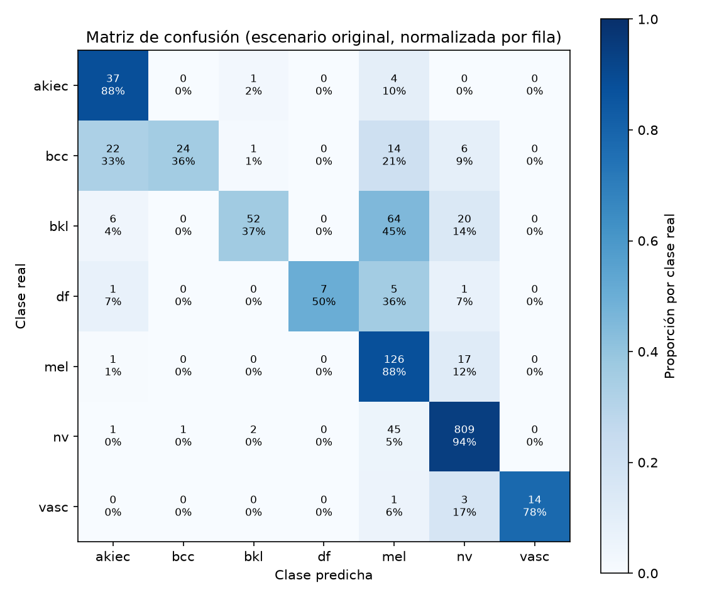

# Reporte de Validación del Modelo — Fase de Evaluación (CRISP-DM)
**Proyecto:** SkinLesionClassifier — Asistente de Diagnóstico Dermatológico con Vision Transformers (ViT)  
**Curso:** Desarrollo de Soluciones de Inteligencia Artificial II — Especialización en Inteligencia Artificial  
**Institución:** Universidad Autónoma de Occidente (UAO)  
**Docente:** Jan Polanco Velasco  
**Autores:** Marlon Valencia Velosa (1113531444) — Miguel Ángel Ortiz Roldán (6200485)  
**Fecha de ejecución:** 1 de octubre de 2026  
**Ticket:** #008 (issue #18) — Rama `feature/model-evaluation`  

---

## 1. Resumen ejecutivo

| Meta (propuesta, hito H3) | Resultado | Estado |
|---|---|---|
| Sensibilidad (recall) de Melanoma > 90 % | **87,5 %** (126 / 144) en el split `test` completo | ❌ No cumplida |
| Latencia de inferencia en CPU < 3 s por imagen | **0,054 s** (p95); máximo 0,084 s | ✅ Cumplida |

**Advertencia principal:** el split de evaluación está **contaminado** con datos de
entrenamiento (sección 3). Las métricas de este reporte son un **techo optimista** del
desempeño, no una medida de generalización. Aun con esa ventaja, el modelo **no alcanza**
la meta de sensibilidad para Melanoma.

Hallazgos clave:

1. La sensibilidad de Melanoma (87,5 %) queda 2,5 puntos por debajo de la meta, con
   precisión baja (48,6 %): el modelo marca como melanoma 133 lesiones que no lo son.
2. El modelo **no es robusto a baja luminosidad**: la sensibilidad de Melanoma cae de
   87,5 % a **9,7 %**, y casi todo se clasifica como nevo (`nv`).
3. El ruido gaussiano degrada poco el desempeño (recall `mel` 79,9 %).
4. En la muestra revisada, Grad-CAM se concentra sobre la lesión solo en 1 de 6 casos
   (sección 8).

## 2. Configuración reproducible

```bash
uv run python -m skin_lesion_classifier.evaluation
```

| Elemento | Valor |
|---|---|
| Modelo | `Anwarkh1/Skin_Cancer-Image_Classification` @ `e37ebda4a662db26d9221c78f6c72b1cb8736ce0` |
| Procesador | `google/vit-base-patch16-224-in21k` (sin revisión fijada) |
| Dataset | `marmal88/skin_cancer` (HAM10000) @ `bdd59e10860746202dfdc452e0ac3a9eaa25268d`, split `test` (1285 imágenes) |
| Hardware | Apple A18 Pro, 6 núcleos, 8 GB RAM, solo CPU |
| Software | Python 3.13.15, PyTorch 2.14.0, Transformers 5.17.0 |
| Duración total | ≈ 6 minutos (3 escenarios × 1285 imágenes + 6 overlays Grad-CAM) |

Pesos y datos se descargan al caché de Hugging Face, nunca al repositorio. Los resultados
completos de esta ejecución están en [`evaluation/metrics.json`](evaluation/metrics.json).

## 3. Limitación crítica: solapamiento entre entrenamiento y evaluación

El modelo se entrenó con el split `train` de `marmal88/skin_cancer` (según su tarjeta en
Hugging Face) y usó `validation` para seleccionar el modelo. Al comparar los
identificadores de los splits (lectura de solo las columnas `image_id` y `lesion_id`):

| Medida | Valor |
|---|---|
| Imágenes de `test` | 1285 |
| Imágenes de `test` idénticas (`image_id`) a una de `train` | **1025 (79,8 %)** |
| Imágenes de `test` cuyo `image_id` no está en `train` | 260 |
| Imágenes de `test` de lesiones nunca vistas en `train` ni `validation` | 28 (1 melanoma) \* |

\* Las tres primeras filas las produce el CLI (`overlap` en `metrics.json`). La última
proviene de un análisis puntual del 2026-10-01 que leyó además `lesion_id` de `train` y
`validation`; el CLI todavía no la calcula (pendiente registrado en el ticket #008).

Los splits suman 13 354 imágenes, pero HAM10000 tiene 10 015: el dataset publicado repite
imágenes entre splits. Por eso:

- Las métricas del split completo miden en buena parte **memoria**, no generalización.
- El subconjunto `unseen_in_train` (260 imágenes) evita imágenes idénticas, pero la mayoría
  comparte lesión (otra fotografía del mismo lunar) con `train`, así que también es
  optimista.
- Con un solo melanoma realmente nuevo, **no es posible validar honestamente la meta de
  sensibilidad** con este dataset. Se requiere un conjunto externo (por ejemplo ISIC 2019/
  2020 o PH2) para esa conclusión.

## 4. Métricas por clase (escenario original, 1285 imágenes)

Exactitud global: **83,2 %**. F1 macro: **0,690**.

| Clase | Nombre | Precisión | Recall | F1 | Soporte |
|---|---|---|---|---|---|
| `akiec` | Queratosis actínica | 0,544 | 0,881 | 0,673 | 42 |
| `bcc` | Carcinoma basocelular | 0,960 | 0,358 | 0,522 | 67 |
| `bkl` | Lesión queratósica benigna | 0,929 | 0,366 | 0,525 | 142 |
| `df` | Dermatofibroma | 1,000 | 0,500 | 0,667 | 14 |
| **`mel`** | **Melanoma** | **0,486** | **0,875** | **0,625** | **144** |
| `nv` | Nevo melanocítico | 0,945 | 0,943 | 0,944 | 858 |
| `vasc` | Lesión vascular | 1,000 | 0,778 | 0,875 | 18 |



Lectura de la matriz de confusión:

- **Melanoma:** 126 aciertos; 17 melanomas se clasifican como nevo benigno. Estos son los
  errores clínicamente más graves (falsos negativos).
- **Sobre-predicción de melanoma:** 64 lesiones `bkl` (45 %), 45 nevos, 14 `bcc` y 5 `df`
  se predicen como `mel`. Para un sistema de tamizaje, este sesgo es preferible a omitir
  melanomas, pero genera muchas falsas alarmas.
- **Carcinoma basocelular:** solo 36 % de recall; 22 casos se confunden con `akiec` y 14 con
  `mel`.

La tarjeta del modelo reporta 96,95 % de exactitud en validación. La exactitud medida aquí
(83,2 %) es menor pese al solapamiento con `train`. Una hipótesis **no verificada** es una
diferencia de preprocesamiento entre el entrenamiento original y el procesador base usado
en este proyecto (`google/vit-base-patch16-224-in21k`).

## 5. Subconjunto sin imágenes repetidas (`unseen_in_train`, 260 imágenes)

Exactitud: **79,2 %**. F1 macro: **0,606**. Recall de Melanoma: **90,0 %** (18 / 20),
que **iguala pero no supera** la meta (> 90 %). Con 20 melanomas, el intervalo de
incertidumbre es amplio: un solo acierto o fallo cambia el resultado en 5 puntos.

## 6. Robustez

Mismo split `test` (1285 imágenes), con la perturbación aplicada a cada imagen antes de la
inferencia. Parámetros deterministas: baja luminosidad con factor 0,4; ruido gaussiano con
σ = 25 y semilla 0.

| Escenario | Exactitud | F1 macro | Recall `mel` | Precisión `mel` |
|---|---|---|---|---|
| Original | 83,2 % | 0,690 | **87,5 %** | 48,6 % |
| Baja luminosidad (×0,4) | 72,3 % | 0,408 | **9,7 %** | 87,5 % |
| Ruido gaussiano (σ = 25) | 82,0 % | 0,676 | **79,9 %** | 46,0 % |

- **Baja luminosidad:** fallo severo. 124 de 144 melanomas pasan a `nv` (nevo benigno). La
  exactitud global se mantiene alta solo porque `nv` es la clase mayoritaria (858 imágenes)
  y el modelo la predice casi siempre. En uso real, una foto subexpuesta podría ocultar un
  melanoma.
- **Ruido gaussiano:** degradación moderada (−7,6 puntos de recall `mel`); el resto de
  clases se mantiene estable.

## 7. Latencia en CPU

| Escenario | Media | p50 | p95 | Máximo |
|---|---|---|---|---|
| Original | 0,052 s | 0,052 s | 0,054 s | 0,084 s |
| Baja luminosidad | 0,055 s | 0,054 s | 0,056 s | 0,081 s |
| Ruido gaussiano | 0,055 s | 0,055 s | 0,056 s | 0,062 s |

La meta (< 3 s) se cumple con amplio margen. La medición incluye preprocesamiento e
inferencia (`InferenceService.predict`), no Grad-CAM ni la red HTTP de la API. El reporte
anterior (`REPORTES_PRUEBAS_Y_CALIDAD.md`) midió ≈ 0,24 s en otra máquina; la diferencia es
de hardware.

## 8. Revisión cualitativa de Grad-CAM

Se generaron 6 overlays (3 melanomas, 3 queratosis actínicas; todos correctamente
clasificados). Las imágenes no se versionan; se regeneran en `reports/evaluation/`.

| Imagen | Clase real / predicha | ¿Mapa coherente con la lesión? |
|---|---|---|
| `ISIC_0024351` | `mel` / `mel` | ✅ Sí: la activación cubre la lesión |
| `ISIC_0024459` | `mel` / `mel` | ⚠️ Parcial: activación en el borde y una franja central |
| `ISIC_0024652` | `mel` / `mel` | ❌ No: la activación se concentra en una esquina con artefactos (vello/marcas) |
| `ISIC_0024329` | `akiec` / `akiec` | ❌ No: activación en piel circundante |
| `ISIC_0024654` | `akiec` / `akiec` | ❌ No: anillo perilesional, centro sin activación |
| `ISIC_0024707` | `akiec` / `akiec` | ❌ No: activación en piel circundante |

Conclusión: en esta muestra pequeña (n = 6), el mapa solo es claramente coherente en 1
caso. El modelo puede estar apoyándose en el contexto de la piel o en artefactos de
captura, lo que coincide con su fragilidad ante cambios de luminosidad. Antes de presentar
el mapa como explicación clínica, conviene revisar una muestra mayor y verificar la capa
objetivo de Grad-CAM.

## 9. Conclusiones y próximos pasos

1. **La meta de sensibilidad de Melanoma no se cumple** (87,5 % frente a > 90 %), incluso
   con datos favorables por el solapamiento.
2. **La meta de latencia se cumple** con amplio margen (0,054 s frente a < 3 s).
3. **No hay evidencia válida de generalización:** el dataset disponible no tiene un
   conjunto de prueba independiente.

Próximos pasos recomendados:

- Evaluar con un conjunto externo nunca visto (ISIC 2019/2020, PH2) y separado por
  `lesion_id`.
- Ajustar el umbral de decisión de `mel` para priorizar sensibilidad y medir el costo en
  falsos positivos.
- Aumentar los datos de entrenamiento con variaciones de brillo, o normalizar la iluminación
  antes de la inferencia, y repetir la prueba de robustez.
- Fijar la revisión del procesador y verificar que coincide con el preprocesamiento usado
  en el entrenamiento.
- Ampliar la revisión de Grad-CAM a una muestra estratificada por clase y por acierto/error.
